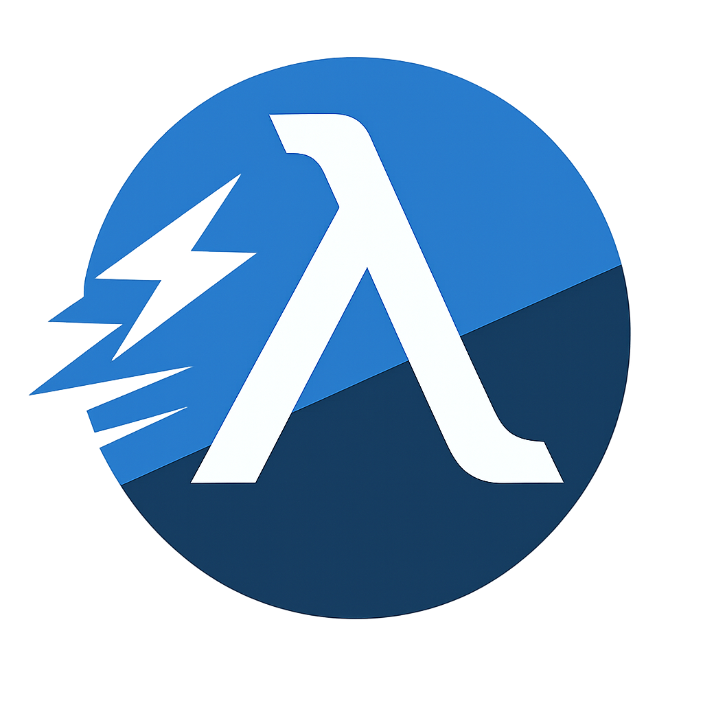

<div align="center">
    <p align="center">
        <h1 align="center"><b>Clobber</b></h1>
        <br/>
        
        <br/>
	Clojure inspired Lisp dialect with native hardware acceleration support.
	<br/>
	<b>SAMPLE README</b>
	<br/>
	<b>Active under development.</b>
    </p>
</div>

<br/>
&nbsp;
Clobber is a statically typed, general purpose language combining the robustness and expressivity of Lisp languages with the speed of hardware accelerated code - all in one package.


&nbsp;
#### Easy to install

``` pwsh
# windows 
choco install bryjen-clobber

# linux/macos
brew install bryjen-clobber
```
No bootstrapping or building from source required, a compatible package manager is all you need.

&nbsp;
#### Native Hardware Acceleration
```clj
(defn -main [& ^string args]
  ; assuming 'read-img' parses an img into a tensor
  (let [^tensor<f32,1,28,28> img1 (read-img "img1.png")
        ^tensor<f32,1,28,28> img2 (read-img "img2.png")]

    (accel
        [^tensor<f32,1,28,28> a img1 
         ^tensor<f32,1,28,28> b img2]
      (matmul (reshape a [1 (* 28 28)])
              (transpose (reshape b [1 (* 28 28)]))))))
```
Clobber provides bindings to interface with various low-level APIs such as Vulkan or specialized runtimes such as the ONNX Runtime.
This is done by defining acceleration blocks and defining tensor operations, which gets parsed into MLIR TOSA, which is then emitted as target-specific, lower-level IR.

&nbsp;
#### Development experience first
```
error: Invalid generic type.
  ┌─ C:\Users\Public\Program.mk:1:22
  |
0 | Result<string, System.Collections.Generic.List<string>>
  |                      ^ Expected a Comma ',', or a GreaterThan '>''.
```
~~Inspired by the error handling and error messages of modern functional languages (OCaml, F#, Rust, Gleam, etc.), the toolchain is developed to make writing and debugging as stress-free and predictable as possible.~~

